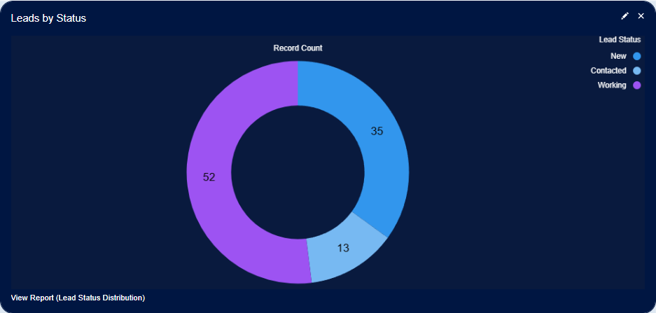
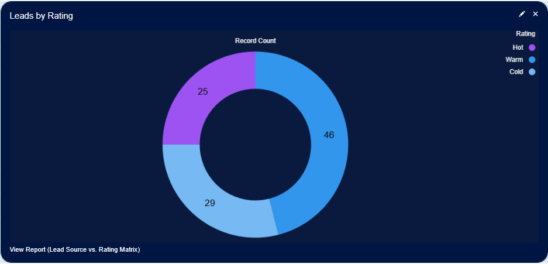
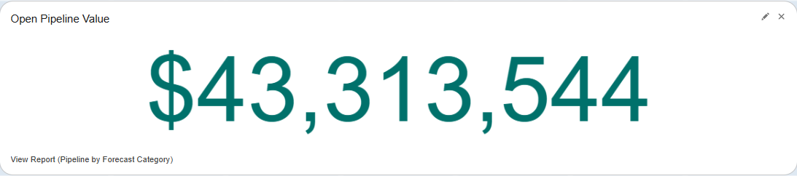
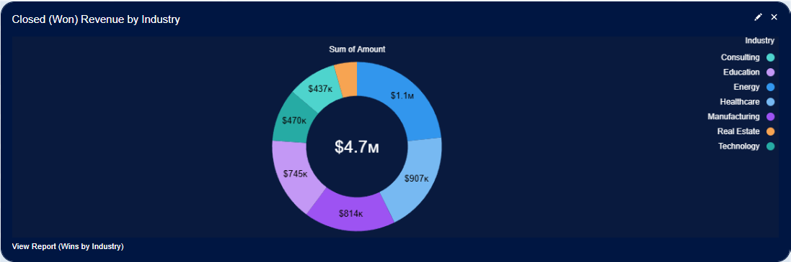
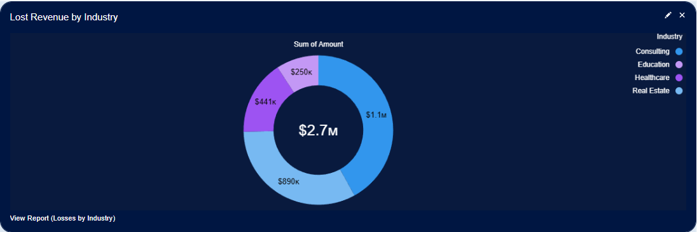
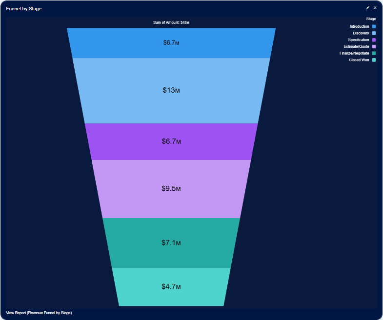
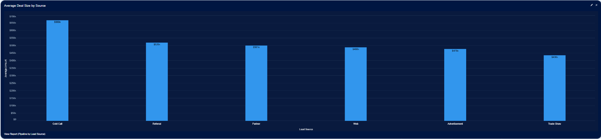

# Lead-to-Revenue Conversion — Dashboard Narrative

> **Author:** Alexander Marvin  
> **Date:** April 2026  
> **Tool:** Salesforce Lightning (Developer Edition)  
> **Data:** 100 Accounts, 100 Contacts, 100 Opportunities, 100 Leads (sample data)  
> **Purpose:** Demonstrate end-to-end RevOps proficiency — mapping the complete buyer journey from lead intake through closed revenue in a single conversion-focused dashboard.

---

## Executive Summary

This dashboard tells the full lead-to-revenue story: how leads enter the funnel, how opportunities progress through pipeline stages, which industries convert into revenue (and which don't), and which channels produce the highest-value deals. It gives Revenue Operations leaders a single view to diagnose conversion inefficiencies, prioritize high-value channels, and connect top-of-funnel activity to bottom-line revenue.

---

## 🔑 Strategic Insights Summary

1. 35% of leads remain in "New" status; 52% are actively "Working"

   **Business Impact:** New leads awaiting contact risk stagnation and missed conversion  
   **Recommended Action:** Prioritize prompt outreach to "New" leads; track Contacted → Working progression

2. 29% of leads rated Cold, 46% Warm, only 25% Hot

   **Business Impact:** Majority of leads require nurturing before sales readiness  
   **Recommended Action:** Nurture Cold and Warm leads toward Hot; prioritize Hot leads for immediate outreach

3. Energy, Healthcare, Manufacturing are the top-converting verticals

   **Business Impact:** Revenue concentration in 3 high-fit industries ($1.086M, $0.907M, $0.814M)  
   **Recommended Action:** Double down on these verticals for expansion and replication of success

4. Consulting has a negative win/loss ratio ($0.437M won vs. $1.145M lost)

   **Business Impact:** Revenue leakage in a high-loss vertical  
   **Recommended Action:** Conduct loss analysis for Consulting and Real Estate; reassess investment

5. $13.374M (~28%) of pipeline concentrated in Discovery

   **Business Impact:** Deals stalling — require support advancing to Specification  
   **Recommended Action:** Sales enablement at the Discovery → Specification transition

6. Cold Call has the highest avg deal size ($669K)

   **Business Impact:** High-value deals from an underestimated source  
   **Recommended Action:** Enhance Cold Call qualification processes; don't deprioritize

7. $43.3M in open pipeline with $4.666M closed-won

   **Business Impact:** Strong pipeline; conversion opportunity ahead  
   **Recommended Action:** Improve lead qualification and pipeline rigor to maximize conversion

---

## 📊 Dashboard Walkthrough

### ROW 1: Lead Intake — Status & Quality Distribution

#### Leads by Status (Donut)

| Status     | Count | % of Total |
|------------|-------|------------|
| New        |  35   |    35%     |
| Contacted  |  13   |    13%     |
| Working    |  52   |    52%     |

**Key Takeaway:**  
The current lead distribution shows that 52% of leads are actively being worked, reflecting strong engagement and movement toward qualification. However, 35% remain in "New" status, awaiting initial contact, and only 13% have reached the "Contacted" stage. This pattern underscores the importance of early engagement and efficient progression through the lead stages, as each step is critical for converting leads into qualified opportunities and ultimately driving revenue growth.

**Recommended Action:**  
- Prioritize prompt outreach to all "New" leads to initiate the qualification process and prevent pipeline stagnation.
- Track and optimize the movement of leads from "Contacted" to "Working" to ensure steady progression toward opportunity creation.
- Regularly analyze lead status distribution to identify bottlenecks and adjust team resources, supporting a healthy flow from lead generation to opportunity conversion.

#### Leads by Rating (Donut)

| Rating | Count | % of Total |
|--------|-------|------------|
| Cold   |  29   |    29%     |
| Warm   |  46   |    46%     |
| Hot    |  25   |    25%     |

**Key Takeaway:**
The distribution of lead ratings shows that 46% of leads are Warm, indicating a strong pool of prospects with potential to become qualified opportunities. However, 29% are still Cold and require significant nurturing, while only 25% are Hot and ready for immediate sales engagement. Effectively moving leads from Cold and Warm to Hot is essential for sustaining a healthy opportunity pipeline.

**Recommended Action:**
- Prioritize immediate outreach to Hot leads, as they represent the most conversion-ready opportunities.
- Implement targeted nurture strategies for Cold and Warm leads to accelerate their progression toward qualification.
- Analyze lead rating trends and sources to refine marketing efforts and increase the proportion of Hot leads entering the funnel.

---

### ROWS 2–4 (Left): Pipeline Value & Revenue Outcomes by Industry

#### Open Pipeline Value (Metric)

| KPI                    | Value       | What It Tells Us |
|------------------------|-------------|------------------|
| Open Pipeline Revenue  | $43,313,544 | Represents the total potential revenue from current opportunities. The effectiveness of leads to opportunities conversion directly impacts future pipeline value and revenue outcomes. |

**Key Takeaway:**  
With $43.3M in active pipeline, there is significant conversion opportunity ahead. The question is how efficiently this pipeline converts — answered by the funnel and revenue breakdowns below.

**Recommended Action:**
- Focus on improving lead qualification and nurturing processes to ensure a steady flow of high-quality opportunities into the pipeline. Regularly review conversion rates and address bottlenecks to maximize the realization of pipeline value.

---

#### Closed (Won) Revenue by Industry (Donut)

| Industry       | Won Revenue |
|----------------|------------|
| Energy         | $1.086M    |
| Healthcare     | $0.907M    |
| Manufacturing  | $0.814M    |
| Education      | $0.745M    |
| Technology     | $0.470M    |
| Consulting     | $0.437M    |
| Real Estate    | $0.206M    |
| Total Won      | $4.666M    |

**Key Takeaway:**  
Energy, Healthcare, and Manufacturing are the top-performing industries in closed-won revenue ($1.086M, $0.907M, and $0.814M, respectively), accounting for the majority of total bookings. This highlights strong product-market fit and effective lead conversion in these verticals. In contrast, Consulting, Technology, and Real Estate contribute less to total revenue, suggesting opportunities to improve qualification, deal size, or win rates in these segments. Understanding these patterns is essential for focusing resources and strategies on the most impactful areas of the pipeline.

**Recommended Action:**
- Double down on successful strategies in Energy, Healthcare, and Manufacturing to further capitalize on strong product-market fit and conversion processes.
- Investigate barriers in Consulting, Technology, and Real Estate—review qualification criteria, sales approach, and deal structure to identify and address conversion gaps.
- Tailor marketing and sales enablement resources to industries with lower win rates to boost overall pipeline performance and revenue growth.

---

#### Lost Revenue by Industry (Donut)

| Industry     | Lost Revenue |
|--------------|--------------|
| Consulting   | $1.145M      |
| Real Estate  | $0.890M      |
| Healthcare   | $0.441M      |
| Education    | $0.250M      |
| Total Lost   | $2.726M      |

**Key Takeaway:**
Consulting and Real Estate account for the highest lost revenue ($1.145M and $0.890M, respectively), indicating significant challenges in converting opportunities within these industries. Healthcare and Education also show notable losses ($0.441M and $0.250M). In Consulting, the lost revenue far exceeds the won revenue ($0.437M won vs. $1.145M lost), highlighting a negative win/loss ratio and signaling the need for focused improvement. Understanding these loss patterns is critical for refining the lead-to-opportunity conversion process.

**Recommended Action:**
- Conduct a thorough loss analysis for Consulting and Real Estate to uncover common objections or process gaps leading to lost deals.
- Reassess resource allocation and sales strategies in underperforming industries, considering whether to adjust approach or prioritize segments with higher conversion rates.
- Implement targeted enablement and training for teams working these verticals to address specific barriers and improve future outcomes.

---

### ROWS 2–4 (Right): Funnel by Stage — Pipeline Progression from First Touch to Close

This funnel spans multiple rows on the dashboard, providing a dominant visual of pipeline health alongside the revenue breakdowns on the left. It bridges the lead intake story (Row 1) with the revenue outcomes — showing exactly how opportunities progress from first touch to closed revenue.

| Stage              | Value     | % of Total ($48M) |
|--------------------|-----------|-------------------|
| Introduction       | $6.704M   | ~14%              |
| Discovery          | $13.374M  | ~28%              |
| Specification      | $6.660M   | ~14%              |
| Estimate/Quote     | $9.512M   | ~20%              |
| Finalize/Negotiate | $7.064M   | ~15%              |
| Closed Won         | $4.666M   | ~10%              |
| Total              | $48M      | ~100%             |

**Key Takeaway:**
The sales pipeline is most concentrated at the Discovery stage ($13.374M, ~28% of total pipeline), indicating that a significant portion of opportunities are pausing here. This does not necessarily mean deals are being lost, but rather that many require additional support to progress. The Discovery stage often demands clearer requirements, deeper technical validation, or stronger solution alignment to advance to Specification. Notably, once deals move past Discovery, they tend to progress more smoothly through Specification and into Estimate/Quote ($9.512M) and Finalize/Negotiate ($7.064M), with $4.666M already closed-won.

**Recommended Action:**
- Prioritize resources and enablement tools to help sales reps advance deals from Discovery to Specification—develop playbooks, technical validation guides, and solution-fit frameworks.
- Analyze successful deals that moved efficiently through Discovery to identify best practices and replicate them across the team.
- Closely monitor late-stage deals in Finalize/Negotiate ($7.064M) to maximize near-term revenue conversion and ensure these high-probability opportunities are prioritized for closing.

---

### ROW 4: Average Deal Size by Lead Source — Channel Efficiency

| Lead Source   | Avg Deal Size |
|---------------|---------------|
| Cold Call     | $669K         |
| Partner       | $501K         |
| Referral      | $520K         |
| Web           | $488K         |
| Advertisement | $478K         |
| Trade Show    | $436K         |

**Key Takeaway:**
Cold Call leads generate the largest average deal size ($669K), outperforming all other sources and challenging the perception that they are lower quality. Partner ($501K) and Referral ($520K) channels also yield above-average deal sizes, highlighting the effectiveness of relationship-driven approaches. In contrast, Trade Show leads result in the smallest average deals ($436K), suggesting that while they may contribute volume, their impact on revenue is less significant.

**Recommended Action:**
- Maintain and enhance qualification processes for Cold Call leads, as they represent the greatest revenue potential when successfully converted.
- Continue to invest in and expand Partner and Referral programs to leverage their strong contribution to deal size and pipeline quality.
- Assess the ROI of Trade Show participation—consider reallocating resources if the lower average deal size does not justify the investment compared to other channels.

---

> *This dashboard is part of a Salesforce RevOps demo project. All data is sample only — no real client information is included.*
