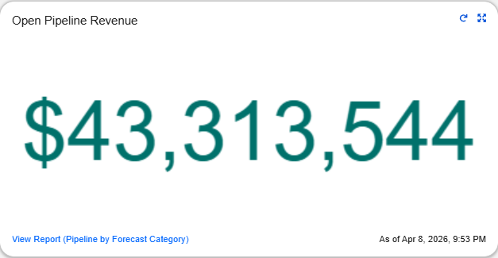
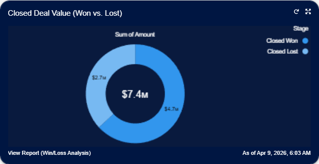
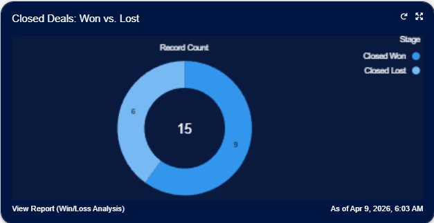
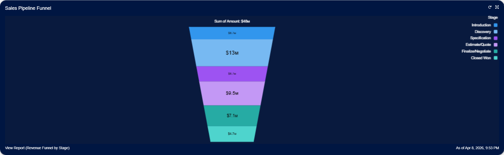
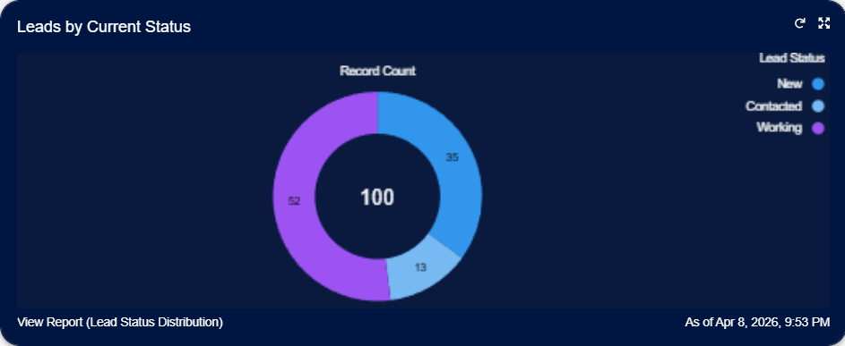
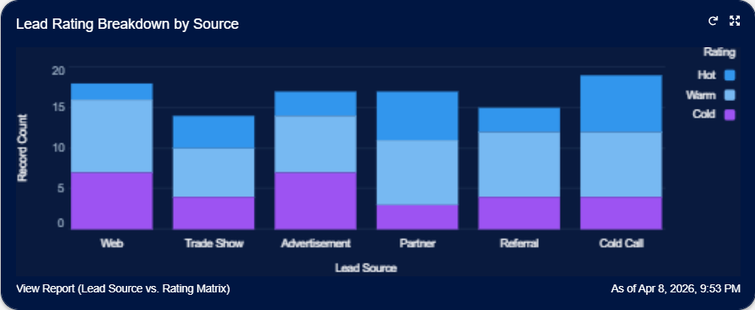
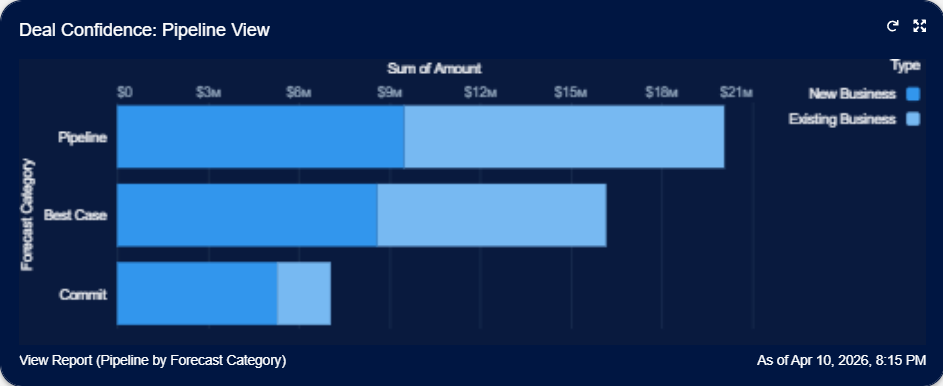
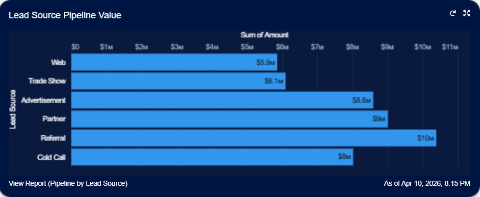
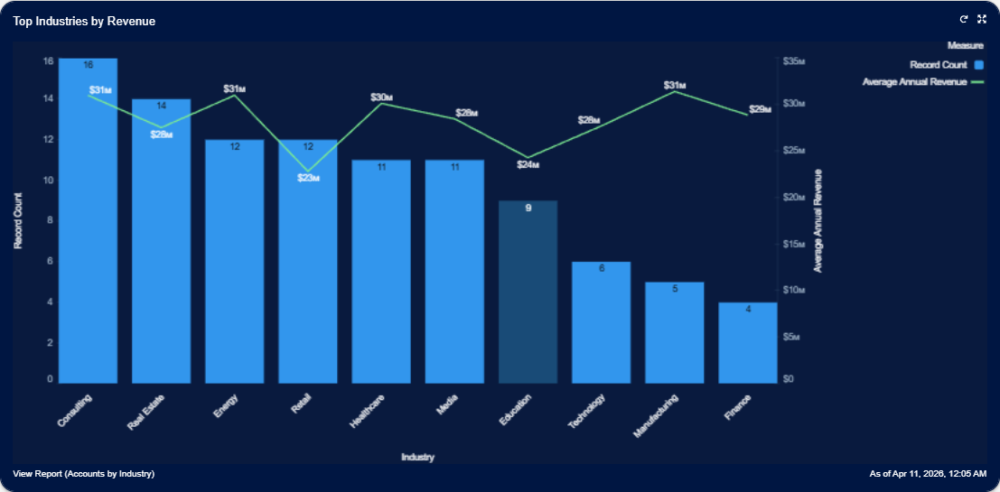
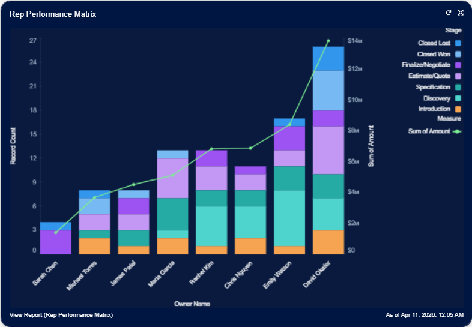

# Revenue Operations Command Center — Dashboard Narrative

> **Author:** Alexander Marvin  
> **Date:** April 2026  
> **Tool:** Salesforce Lightning (Developer Edition)  
> **Data:** 100 Accounts, 100 Contacts, 100 Opportunities, 100 Leads (sample data)  
> **Purpose:** Demonstrate RevOps operational command — providing a single-pane view of pipeline health, forecast confidence, lead quality distribution, channel ROI, industry performance, and rep-level productivity across the full revenue engine.

---

## Executive Summary

This dashboard is the operational nerve center for Revenue Operations. It answers the questions a RevOps leader asks every Monday morning: How much pipeline do we have? How confident are we in it? Where are deals stalling? Which channels and industries are generating the most value? And which reps need coaching versus which should be studied for best practices? Unlike a conversion-focused view, this dashboard is built for day-to-day pipeline management — surfacing the levers an ops team can pull to improve forecast accuracy, accelerate deal velocity, and balance workload across the team.

---

## 🔑 Strategic Insights Summary

1. $43.3M open pipeline with 64% win rate (by value)

**Business Impact:** Strong pipeline base; proven ability to close

**Recommended Action:** Maintain qualification standards; protect win rate as pipeline scales

2. $13.4M (~28%) of pipeline concentrated in Discovery stage

**Business Impact:** Deals stalling — clients need support progressing to Specification

**Recommended Action:** Focus sales enablement at Discovery → Specification; provide playbooks and scoping tools

3. Only 16.4% of pipeline in "Commit" forecast category

**Business Impact:** Forecast accuracy at risk; most pipeline loosely categorized

**Recommended Action:** Require forecast category updates at each stage gate; prioritize moving Best Case to Commit

4. Referral is the #1 pipeline source by value ($10.4M)

**Business Impact:** Relationship-driven channels drive the largest revenue pool

**Recommended Action:** Expand referral and partner programs; incentivize introductions

5. Cold Call: high volume (19 leads) but high quality (7 Hot, 8 Warm)

**Business Impact:** High-value leads from an outbound channel

**Recommended Action:** Double down on Cold Call and Partner channels; enhance qualification and nurture

6. Retail and Education underperform in avg revenue vs. high-ROI peers

**Business Impact:** Low revenue efficiency per account in these verticals
**Recommended Action:** Investigate deal sizing and conversion; consider reallocating coverage to higher-ROI verticals

7. David Okafor + Emily Watson carry 43% of all deals and 44% of pipeline

**Business Impact:** Concentration risk and best-practice opportunity

**Recommended Action:** Document top-performer workflows; rebalance workload to develop other reps

8. 35% of leads still in "New" status

**Business Impact:** Delayed engagement risks pipeline generation

**Recommended Action:** Implement SLAs; auto-assign Hot leads for immediate outreach

---

## 📊 Dashboard Walkthrough

### ROW 1: Executive KPIs — Pipeline, Revenue, and Win Rate at a Glance

#### Open Pipeline Revenue (Metric)

| KPI                  |     Value     |
|----------------------|---------------|
| Open Pipeline Revenue| $43,313,544   |

**Key Takeaway:**  
$43.3M in active pipeline represents the total addressable revenue the sales team is currently working. This is the denominator against which all downstream metrics — conversion rate, forecast accuracy, stage velocity — are measured.

---

#### Closed Deal Value: Won vs. Lost (Donut)

| Outcome      |  Amount  | % of Closed |
|--------------|----------|-------------|
| Closed Won   |  $4.7M   |    64%      |
| Closed Lost  |  $2.7M   |    36%      |
| Total Closed |  $7.4M   |   100%      |

**Key Takeaway:**  
Of the $7.4M that has exited the pipeline, 64% converted to revenue ($4.7M) and 36% was lost ($2.7M). The dollar-weighted win rate is healthy, but $2.7M in lost revenue warrants loss-reason analysis to recover preventable churn in future quarters.

**Recommended Action:**
- Conduct a loss-reason analysis for closed-lost deals to identify common patterns or objections.
- Implement targeted coaching or process improvements to address the top causes of lost revenue.
- Review win/loss data quarterly to track progress and refine strategies.

---

#### Closed Deals: Won vs. Lost (Donut)

| Outcome      | Count | % of Total |
|--------------|-------|------------|
| Closed Won   |   9   |    60%     |
| Closed Lost  |   6   |    40%     |
| Total Closed |  15   |   100%     |

**Key Takeaway:**  
A 60% win rate (9 of 15 closed deals) is a solid baseline. Pairing this with the dollar-weighted view above, the team is winning both more deals and higher-value deals — indicating that deal qualification is generally effective. The 6 lost deals should still be reviewed for patterns (stage of loss, industry, rep, lead source) to prevent future losses.

**Recommended Action:**  
- Establish a closed-lost review cadence (weekly or bi-weekly) to capture loss reasons while context is fresh.
- Cross-reference lost deals by industry and stage to identify whether losses cluster in specific segments or pipeline phases.

---

### ROW 2: Sales Pipeline Funnel — Stage-by-Stage Pipeline Distribution

| Stage               |  Value   | % of Total ($48M) |
|---------------------|----------|-------------------|
| Introduction        |  $6.7M   |     ~14%          |
| Discovery           | $13.4M   |    ~27.9%         |
| Specification       |  $6.7M   |     ~14%          |
| Estimate/Quote      |  $9.5M   |    ~19.8%         |
| Finalize/Negotiate  |  $7.1M   |    ~14.8%         |
| Closed Won          |  $4.7M   |    ~9.8%          |
| Total               |  $48M    |    ~100%          |

**Key Takeaway:**
The funnel is heaviest at the Discovery stage — $13.4M, representing ~27.9% of total pipeline value. **This concentration signals that deals are accumulating in Discovery rather than progressing at a steady pace.** Discovery is often the most consultative phase of the sales cycle, where prospects are defining their requirements and evaluating fit. When deals stall here, it typically means clients need more structured support — clearer scoping, deeper needs analysis, or stronger alignment between their goals and the proposed solution — before they can advance to Specification.

Importantly, the funnel refills after Specification: Estimate/Quote holds $9.5M (19.8%) and Finalize/Negotiate holds $7.1M (14.8%). This means that once deals clear the Discovery bottleneck, they tend to progress more smoothly through the later stages. The operational priority is not plugging a leak — it's accelerating flow through the Discovery-to-Specification transition.

**Recommended Action:**
- Focus sales enablement resources on the Discovery → Specification handoff. Equip reps with discovery-to-spec playbooks, requirements templates, and technical validation checklists.
- Identify common characteristics of deals that move quickly through Discovery — replicate that motion across the team.
- Monitor Finalize/Negotiate closely: $7.1M in late-stage deals (~14.8% of pipeline) represents near-term closeable revenue.

---

### ROW 3: Lead Intake & Quality — Status Distribution and Source-Level Rating

#### Leads by Current Status (Donut)

| Status     | Count | % of Total |
|------------|-------|------------|
| New        |  35   |    35%     |
| Contacted  |  13   |    13%     |
| Working    |  52   |    52%     |

**Key Takeaway:**
The majority of leads (52%) are in the "Working" status, indicating active engagement by the sales team. Only 35% remain in "New" status (uncontacted and unqualified), while 13% have been "Contacted" but not yet advanced. This distribution suggests strong pipeline activity, but also highlights the importance of quickly moving new leads into active working status to maximize conversion opportunities.

**Recommended Action:**
- Maintain focus on progressing leads from "Contacted" to "Working" to ensure no leads stall in early stages.
- Continue to implement lead response SLAs — target contact within 24 hours of creation.
- Review the 35 "New" leads to ensure they are promptly assigned and engaged, preventing potential pipeline leakage.

**Key Takeaway:**  
Over half of all leads (52%) remain in "New" status — uncontacted and unqualified. Only 13% have progressed to "Working," where active engagement is occurring. This backlog represents both risk (stale leads lose interest) and opportunity (untapped pipeline if engaged quickly).

**Recommended Action:**  
- Implement lead response SLAs — target contact within 24 hours of creation.
- Auto-assign Hot-rated "New" leads for priority outreach.
- Audit whether the 52 "New" leads reflect a recent batch import or a sustained processing gap.

---

#### Lead Rating Breakdown by Source (Stacked Bar)

| Lead Source   | Hot | Warm | Cold | Total |
|---------------|-----|------|------|-------|
| Web           |  2  |  9   |  7   |  18   |
| Trade Show    |  4  |  6   |  4   |  14   |
| Advertisement |  3  |  7   |  7   |  17   |
| Partner       |  6  |  8   |  3   |  17   |
| Referral      |  3  |  8   |  4   |  15   |
| Cold Call     |  7  |  8   |  4   |  19   |
| Total         | 25  | 46   | 29   | 100   |

**Key Takeaway:**
**Cold Call generates the most leads (19)**, but also has a high proportion of Hot (7) and Warm (8) leads, with only 4 Cold. **Partner also stands out with 6 Hot and 8 Warm out of 17 total**, *making it the best source for high-quality leads.* **In contrast, Web and Advertisement produce more Cold leads (7 each) and fewer Hot (2 and 3, respectively).** This chart demonstrates that not all high-volume channels deliver the same quality mix, and relationship-driven sources (Partner, Referral) tend to yield more sales-ready leads.

**Recommended Action:**
- Double down on Partner and Cold Call channels, which deliver the highest number of Hot and Warm leads.
- Reevaluate investment in Web and Advertisement, focusing on improving lead qualification or nurturing to boost Hot lead conversion.
- For Referral, explore ways to increase Hot lead conversion, as it produces a solid number of Warm leads but relatively few Hot.
- Continue monitoring Trade Show performance, as it provides a balanced mix of lead quality.

---

### ROW 4: Pipeline Deep Dive — Forecast Confidence and Channel Value

#### Deal Confidence: Pipeline View (Horizontal Stacked Bar)

| Forecast Category | New Business | Existing Business |   Total   | % of Open Pipeline |
|-------------------|--------------|-------------------|-----------|--------------------|
| Pipeline          |   ~$9.5M     |     ~$10.6M       |  ~$20.1M  |      ~46.4%        |
| Best Case         |   ~$8.6M     |     ~$7.6M        |  ~$16.2M  |      ~37.4%        |
| Commit            |   ~$5.3M     |     ~$1.8M        |  ~$7.1M   |      ~16.4%        |
| Total             |  ~$23.4M     |     ~$20M         |  ~$43.4M  |      ~100%         |

**Key Takeaway:**  
Only 16.4% of the open pipeline (~$7.1M) is in the "Commit" category — these are the high-confidence deals the team expects to close. Nearly half (46.4%, ~$20.1M) sits in the loosest "Pipeline" category, meaning those deals have not yet been advanced to a stronger forecast position. This is a forecast hygiene signal: either deals are legitimately early-stage, or reps are not updating forecast categories as deals progress.

The New Business vs. Existing Business split is approximately $23.4M to $20M, showing a healthy balance between new pipeline generation and existing business opportunities. However, there is a significant drop-off in the Commit stage for existing business (only $1.8M vs. ~$5.3M for new business), which may indicate challenges in closing renewals or expansions. Additionally, for existing business, there is a sharp decline from Best Case ($7.6M) to Commit (~$1.8M), suggesting that many renewal or expansion opportunities are stalling before reaching high-confidence close status. This pattern warrants further investigation to identify and address obstacles in advancing existing business deals through the final stages.

**Recommended Action:**
- Require reps to update forecast categories at every stage transition — forecast accuracy depends on consistent categorization.
- Inspect the ~$20.1M "Pipeline" bucket: are these deals truly early-stage, or have some progressed without being recategorized?
- Prioritize moving Best Case deals (~$16.2M) to Commit through executive engagement, proof-of-concept delivery, or negotiation acceleration.
- Investigate the low Commit value for existing business to identify potential obstacles in closing renewals or upsell opportunities.

---

#### Lead Source Pipeline Value (Horizontal Bar)

|  Lead Source  | Pipeline Value |
|---------------|----------------|
| Referral      |     $10.4M     |
| Partner       |     $9M        |
| Advertisement |     $8.6M      |
| Cold Call     |     $8M        |
| Trade Show    |     $6.1M      |
| Web           |     $5.9M      |

**Key Takeaway:**
**Referral-sourced deals carry the most total pipeline value ($10.4M)**, followed by Partner ($9M) and Advertisement ($8.6M). Cold Call also contributes significantly ($8M), while Trade Show ($6.1M) and Web ($5.9M) lag behind. This breakdown highlights that relationship-driven channels (Referral and Partner) are the primary drivers of pipeline value, but digital and outbound channels (Advertisement, Cold Call) also play a substantial role.

Notably, Advertisement outpaces Cold Call and Web in total pipeline value, suggesting that marketing investments are translating into higher-value opportunities than previously assumed. Web, despite being a common lead source, generates the lowest pipeline value, indicating a potential conversion or qualification gap.

**Recommended Action:**
- Protect and expand Referral and Partner programs — these remain the highest-value sources by total pipeline contribution.
- Continue investing in Advertisement, as it is now a top-three pipeline source and may offer scalable growth.
- For Cold Call, focus on improving lead qualification to maximize the value of opportunities generated.
- Investigate why Web ($5.9M) generates the least pipeline value despite likely high lead volume; address any conversion or handoff issues between marketing and sales.
- Review Trade Show ROI to determine if the pipeline value justifies the investment compared to other channels.

---

### ROW 5: Market & Team Performance — Industry Revenue and Rep Productivity

#### Top Industries by Revenue (Combo Chart)

| Industry      | Account Count | Avg Annual Revenue |
|---------------|---------------|--------------------|
| Manufacturing |       5       |      $31.4M        |
| Consulting    |      16       |      $31M          |
| Energy        |      12       |      $31M          |
| Healthcare    |      11       |      $30.2M        |
| Finance       |       4       |      $28.9M        |
| Media         |      11       |      $28.5M        |
| Technology    |       6       |      $27.7M        |
| Real Estate   |      14       |      $27.6M        |
| Education     |       9       |      $24.3M        |
| Retail        |      12       |      $22.8M        |

**Key Takeaway:** 
This chart highlights both account volume and revenue efficiency by industry. **Consulting leads with 16 accounts and a strong $31M average annual revenue**, making it the largest and most valuable segment. **Real Estate (14 accounts, $27.6M avg)** and **Retail (12 accounts, $22.8M avg)** are also major segments, though Retail lags in average revenue. **Energy, Healthcare, and Manufacturing all show high average revenues ($30M+)**, while **Media ($28.5M avg)** and **Technology ($27.7M avg)** demonstrate solid per-account value despite lower volume. Education has fewer accounts (9) and the lowest average revenue ($24.3M).

This view is essential for territory planning: volume leaders (Consulting, Real Estate, Retail) require broad coverage, while high-ROI verticals (Consulting, Energy, Manufacturing, Healthcare) offer the best per-account returns.

**Recommended Action:**
- Prioritize expansion in high-ROI verticals like Consulting, Energy, Manufacturing, and Healthcare, where average revenue per account is highest.
- Ensure volume leaders (Consulting, Real Estate, Retail) have sufficient rep coverage to maximize opportunity.
- Investigate Retail and Education’s lower average revenue to determine if these verticals warrant continued focus or if resources should shift to higher-ROI industries.

---

#### Rep Performance Matrix (Stacked Bar)

| Rep           | Deal Count | Total Pipeline Value | Avg Deal Value |
|---------------|------------|----------------------|----------------|
| David Okafor  |     26     |       $13.9M         |     $533K      |
| Emily Watson  |     17     |       $8.4M          |     $494K      |
| Maria Garcia  |     13     |       $5.1M          |     $394K      |
| Rachel Kim    |     13     |       $6.8M          |     $526K      |
| Chris Nguyen  |     11     |       $6.9M          |     $625K      |
| James Patel   |      8     |       $4.5M          |     $565K      |
| Michael Torres|      8     |       $3.7M          |     $460K      |
| Sarah Chen    |      4     |       $1.4M          |     $350K      |

**Key Takeaway:**  
**David Okafor is the standout performer** — 26 deals totaling $13.9M in pipeline, more than any other rep by a wide margin. Emily Watson follows at 17 deals and $8.4M. Together, these two reps carry **43 of 100 deals (43%) and ~$22M of total pipeline (44%)**. This is both impressive and a concentration risk: if either rep is unavailable, nearly half the pipeline is unmanaged.

At the other end, the bottom three reps (Sarah Chen, Michael Torres, James Patel) collectively manage only 20 deals and ~$9.6M — potential capacity for additional pipeline if workload is rebalanced.

The stacked segments also reveal stage distribution per rep: a healthy mix of stages suggests active pipeline management, while concentration in early stages may indicate reps who are building pipeline but not progressing it.

**Recommended Action:**  
- Study David Okafor's and Emily Watson's workflows — their deal velocity and volume make them the internal benchmark. Document their qualification process, follow-up cadence, and discovery-to-spec motion.
- Evaluate workload balance: Sarah Chen (4 deals) and Michael Torres (8 deals) have significant capacity. Consider redistributing incoming leads or accounts to level the field.
- Check Chris Nguyen's profile: despite having only 11 deals, the $6.9M total and $625K avg deal value suggest high-value deal selection. If intentional, this is a specialization play worth supporting.

---

> *This dashboard is part of a Salesforce RevOps demo project. All data is sample only — no real client information is included.*
